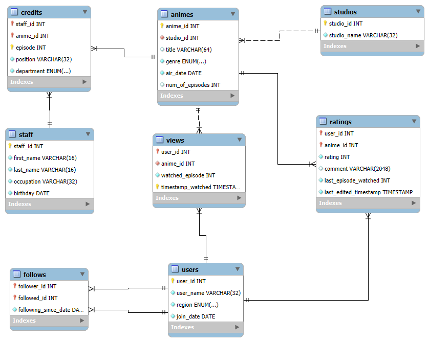

# AnimeList ~ CCINFOM-S14-Group-1

> [Proposal link](https://docs.google.com/document/d/1w6PWOcEWmf8muLjKiBzoehkScjm_1f5jh0E6ibEuB20/edit#heading=h.rqv26w8jpea5)

## Compilation and running instructions

1. Run [the `dbanime.sql` database creation script](src/model/sql/dbanime.sql) in MySQL Workbench.

2. Create a file named `password.in`. Place in your MySQL Workbench credentials inside in the following format:

    ```txt
    username
    password
    ```

3. Use [the `run.bat` script](run.bat).


