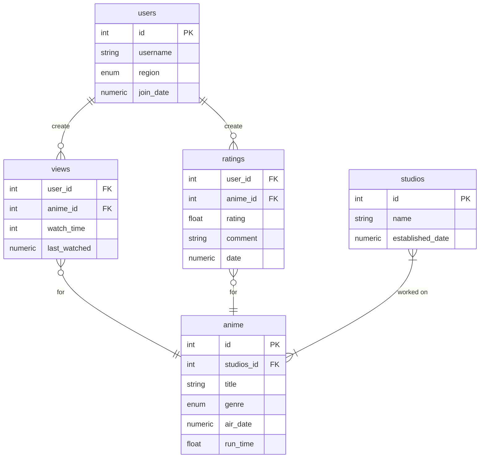

> Note: SQL queries written below are really rough drafts

Possible Transactions
1. Rating an anime episode
2. a
3. a
4. a

Possible Reports
1. Highest rated anime
  ```SQL
    SELECT
        anime.title
    FROM
        anime
        JOIN ratings ON anime.id = ratings.anime_id
    GROUP BY
        anime.id
    ORDER BY
        AVG(ratings.rating) DESC
    LIMIT 1;
  ```

2. Most popular studio: most common studio among the top 10(?) most viewed anime

3. A user's favorite genre: most common genre among the user's top 10(?) favorite anime
   1. Can lead to **recommending an anime** based off the genre

4. A user's favorite anime: highest rated anime by the user
  ```SQL
    SELECT
        anime.title
    FROM
        anime
        JOIN ratings ON anime.id = ratings.anime_id AND ratings.user_id = ?
    GROUP BY
        anime.id
    ORDER BY
        ratings.rating DESC
    LIMIT 1;
  ```
